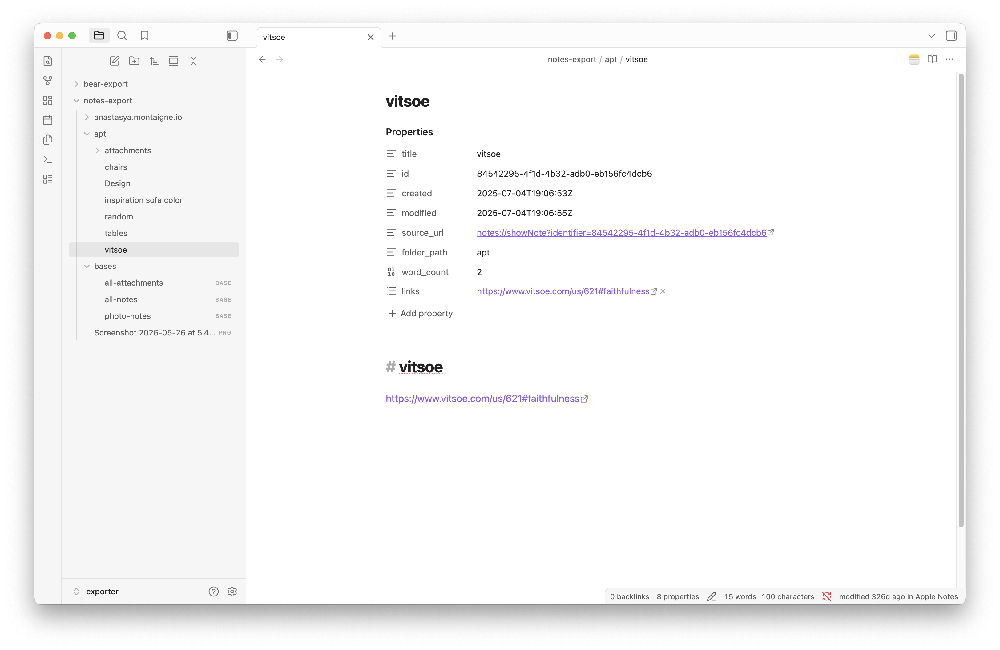
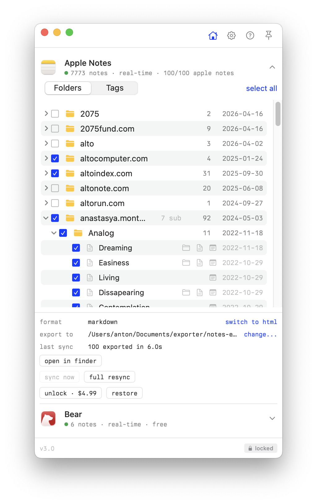
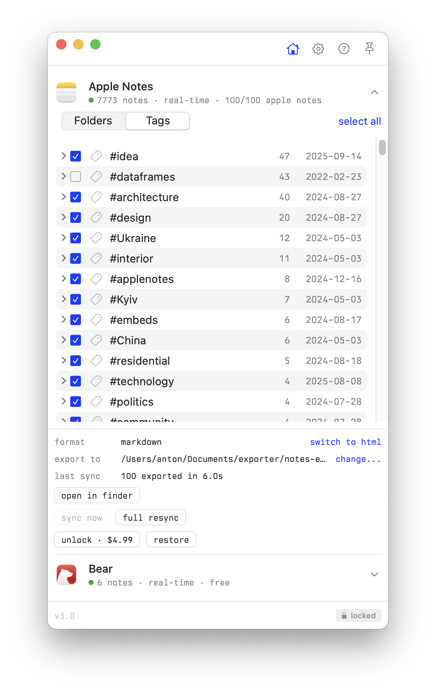
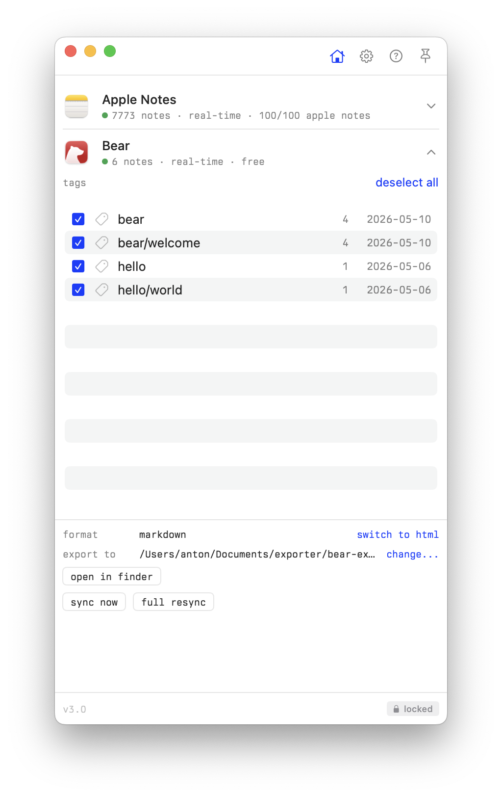

# Exporter

Obsidian plugin for exported Apple Notes and Bear Notes.

Decorates `notes://` and `bear://` links with native app icons and lets you open notes in their source app directly from Obsidian.

Works with [Notes Exporter](https://apps.apple.com/us/app/notes-exporter/id6741618455?mt=12) for Apple Notes and any Bear export that includes source URLs in frontmatter.



## Features

- native app icons on `notes://` and `bear://` links in reading view, live preview, and properties panel
- "Open in Apple Notes" / "Open in Bear" in file and editor context menus
- native app icon button in the tab header bar
- status bar showing source app and last modified time
- command palette: "Open in native app"

## Notes Exporter app

Export your Apple Notes and Bear Notes as markdown using [Notes Exporter](https://apps.apple.com/us/app/notes-exporter/id6741618455?mt=12). Select folders or tags, export to a folder, and open it as an Obsidian vault.

  

## How it works

The plugin reads `source_url` (or `source` / `link`) from frontmatter and matches it against `notes://` and `bear://` schemes.

Apple Notes exported files typically have frontmatter like:

```yaml
source_url: "notes://showNote?identifier=..."
```

## Install

### From Obsidian community plugins

Search for "Exporter" in Settings > Community plugins > Browse.

### Manual

Copy `main.js`, `manifest.json`, and `styles.css` to your vault at `.obsidian/plugins/exporter/`.

## Development

```
npm install
npm run build       # build main.js
npm run dev         # watch mode
npm run typecheck   # type check
```

## License

MIT
